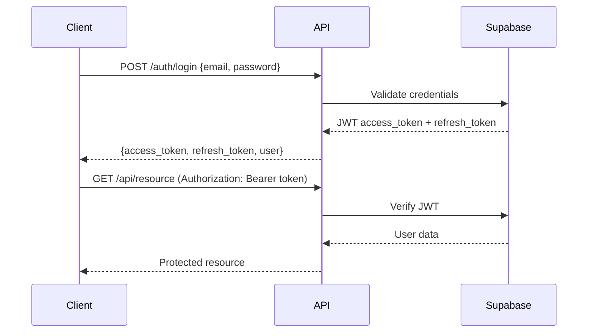

# Authentication & Error Handling Guide

Comprehensive guide for authentication patterns and error handling in the CISCE Platform API.

---

## Table of Contents

1. [Authentication](#authentication)
2. [Authorization](#authorization)
3. [Error Handling](#error-handling)
4. [HTTP Status Codes](#http-status-codes)
5. [Error Codes Reference](#error-codes-reference)
6. [Best Practices](#best-practices)

---

## Authentication

### Overview

The CISCE Platform uses Supabase Authentication with JWT (JSON Web Tokens) for securing API endpoints.

### Authentication Flow



### Authentication Methods

#### 1. Email/Password Authentication

**Sign In:**
```typescript
import { supabase } from '@/lib/supabase';

async function signIn(email: string, password: string) {
  const { data, error } = await supabase.auth.signInWithPassword({
    email,
    password,
  });

  if (error) {
    if (error.message === 'Invalid login credentials') {
      throw new Error('Invalid email or password');
    }
    if (error.message.includes('Email not confirmed')) {
      throw new Error('Please verify your email before logging in');
    }
    throw error;
  }

  return {
    user: data.user,
    session: data.session,
  };
}
```

**Sign Up:**
```typescript
async function signUp(email: string, password: string, metadata?: any) {
  const { data, error } = await supabase.auth.signUp({
    email,
    password,
    options: {
      data: metadata,
      emailRedirectTo: `${window.location.origin}/auth/callback`
    }
  });

  if (error) {
    if (error.message.includes('already registered')) {
      throw new Error('An account with this email already exists');
    }
    if (error.message.includes('Password')) {
      throw new Error('Password must be at least 6 characters');
    }
    throw error;
  }

  return data;
}
```

**Sign Out:**
```typescript
async function signOut() {
  const { error } = await supabase.auth.signOut();
  if (error) throw error;
}
```

#### 2. Token-Based API Calls

**Automatic Token Injection (Recommended):**
```typescript
// Supabase client automatically includes token
const { data, error } = await supabase
  .from('incidents')
  .select('*');
// Token is automatically added to request
```

**Manual Token Usage:**
```typescript
async function callApiWithToken(endpoint: string, data: any) {
  const { data: { session } } = await supabase.auth.getSession();

  if (!session?.access_token) {
    throw new Error('Not authenticated');
  }

  const response = await fetch(endpoint, {
    method: 'POST',
    headers: {
      'Authorization': `Bearer ${session.access_token}`,
      'Content-Type': 'application/json',
    },
    body: JSON.stringify(data)
  });

  if (!response.ok) {
    const error = await response.json();
    throw new Error(error.message);
  }

  return response.json();
}
```

#### 3. Session Management

**Get Current Session:**
```typescript
async function getCurrentSession() {
  const { data: { session }, error } = await supabase.auth.getSession();

  if (error) throw error;
  return session;
}
```

**Refresh Session:**
```typescript
async function refreshSession() {
  const { data: { session }, error } = await supabase.auth.refreshSession();

  if (error) throw error;
  return session;
}
```

**Listen to Auth Changes:**
```typescript
import { useEffect } from 'react';

function useAuthStateListener() {
  useEffect(() => {
    const { data: { subscription } } = supabase.auth.onAuthStateChange(
      (event, session) => {
        if (event === 'SIGNED_IN') {
          console.log('User signed in:', session?.user);
        } else if (event === 'SIGNED_OUT') {
          console.log('User signed out');
        } else if (event === 'TOKEN_REFRESHED') {
          console.log('Token refreshed');
        } else if (event === 'USER_UPDATED') {
          console.log('User updated');
        }
      }
    );

    return () => {
      subscription.unsubscribe();
    };
  }, []);
}
```

#### 4. Password Reset

**Request Reset:**
```typescript
async function requestPasswordReset(email: string) {
  const { error } = await supabase.auth.resetPasswordForEmail(email, {
    redirectTo: `${window.location.origin}/auth/reset-password`
  });

  if (error) throw error;
}
```

**Update Password:**
```typescript
async function updatePassword(newPassword: string) {
  const { data, error } = await supabase.auth.updateUser({
    password: newPassword
  });

  if (error) throw error;
  return data;
}
```

---

## Authorization

### Row Level Security (RLS)

Authorization is primarily handled through PostgreSQL Row Level Security policies.

#### Common RLS Patterns

**Owner-Based Access:**
```sql
-- Users can only see their own incidents
CREATE POLICY "Users can view own incidents"
  ON incidents FOR SELECT
  TO authenticated
  USING (auth.uid() = created_by);

-- Users can only update their own incidents
CREATE POLICY "Users can update own incidents"
  ON incidents FOR UPDATE
  TO authenticated
  USING (auth.uid() = created_by)
  WITH CHECK (auth.uid() = created_by);
```

**Role-Based Access:**
```sql
-- Admins can view all incidents
CREATE POLICY "Admins can view all incidents"
  ON incidents FOR SELECT
  TO authenticated
  USING (
    (SELECT role FROM users WHERE id = auth.uid()) = 'admin'
  );

-- Managers can view team incidents
CREATE POLICY "Managers can view team incidents"
  ON incidents FOR SELECT
  TO authenticated
  USING (
    team_id IN (
      SELECT team_id FROM team_members
      WHERE user_id = auth.uid() AND role IN ('manager', 'admin')
    )
  );
```

**Public Read, Authenticated Write:**
```sql
-- Anyone can read
CREATE POLICY "Public read access"
  ON incidents FOR SELECT
  TO anon, authenticated
  USING (true);

-- Only authenticated users can write
CREATE POLICY "Authenticated users can insert"
  ON incidents FOR INSERT
  TO authenticated
  WITH CHECK (auth.uid() = created_by);
```

#### Checking Permissions in Code

```typescript
async function checkUserPermission(
  userId: string,
  permission: string
): Promise<boolean> {
  const { data, error } = await supabase
    .from('user_permissions')
    .select('permission')
    .eq('user_id', userId)
    .eq('permission', permission)
    .maybeSingle();

  if (error) return false;
  return !!data;
}

async function requirePermission(permission: string) {
  const { data: { user } } = await supabase.auth.getUser();

  if (!user) {
    throw new Error('Authentication required');
  }

  const hasPermission = await checkUserPermission(user.id, permission);

  if (!hasPermission) {
    throw new Error(`Missing required permission: ${permission}`);
  }
}

// Usage
try {
  await requirePermission('incidents:delete');
  await deleteIncident(id);
} catch (error) {
  console.error(error.message);
}
```

---

## Error Handling

### Error Response Format

All API errors follow a consistent format:

```typescript
interface ApiErrorResponse {
  success: false;
  error: {
    code: string;
    message: string;
    details?: any;
    field?: string;
  };
  request_id?: string;
  timestamp?: string;
}
```

### Error Types

#### 1. Validation Errors

**Single Field Error:**
```json
{
  "success": false,
  "error": {
    "code": "VALIDATION_ERROR",
    "message": "Invalid input",
    "field": "email",
    "details": "Email must be a valid email address"
  }
}
```

**Multiple Field Errors:**
```json
{
  "success": false,
  "error": {
    "code": "VALIDATION_ERROR",
    "message": "Multiple validation errors",
    "details": [
      {
        "field": "title",
        "message": "Title is required"
      },
      {
        "field": "severity",
        "message": "Severity must be one of: low, medium, high, critical"
      }
    ]
  }
}
```

#### 2. Authentication Errors

```json
{
  "success": false,
  "error": {
    "code": "UNAUTHORIZED",
    "message": "Authentication required. Please log in to continue."
  }
}
```

```json
{
  "success": false,
  "error": {
    "code": "TOKEN_EXPIRED",
    "message": "Your session has expired. Please log in again."
  }
}
```

#### 3. Authorization Errors

```json
{
  "success": false,
  "error": {
    "code": "FORBIDDEN",
    "message": "You do not have permission to perform this action",
    "details": {
      "required_permission": "incidents:delete",
      "user_permissions": ["incidents:read", "incidents:write"]
    }
  }
}
```

#### 4. Not Found Errors

```json
{
  "success": false,
  "error": {
    "code": "NOT_FOUND",
    "message": "Incident with id '123e4567-e89b-12d3-a456-426614174000' not found"
  }
}
```

#### 5. Conflict Errors

```json
{
  "success": false,
  "error": {
    "code": "CONFLICT",
    "message": "An incident with this title already exists",
    "details": {
      "field": "title",
      "value": "Network Outage",
      "existing_id": "123e4567-e89b-12d3-a456-426614174000"
    }
  }
}
```

#### 6. Rate Limit Errors

```json
{
  "success": false,
  "error": {
    "code": "RATE_LIMIT_EXCEEDED",
    "message": "Too many requests. Please try again in 60 seconds.",
    "details": {
      "limit": 100,
      "remaining": 0,
      "reset_at": "2025-12-31T13:00:00Z"
    }
  }
}
```

#### 7. Server Errors

```json
{
  "success": false,
  "error": {
    "code": "INTERNAL_ERROR",
    "message": "An unexpected error occurred. Please try again later.",
    "request_id": "req-123456"
  }
}
```

### Error Handling Utilities

#### Error Handler Function

```typescript
class ApiError extends Error {
  constructor(
    public code: string,
    public message: string,
    public statusCode: number,
    public details?: any
  ) {
    super(message);
    this.name = 'ApiError';
  }
}

function handleSupabaseError(error: any): never {
  // PostgreSQL constraint errors
  if (error.code === '23505') {
    throw new ApiError(
      'CONFLICT',
      'This record already exists',
      409,
      { constraint: error.constraint }
    );
  }

  if (error.code === '23503') {
    throw new ApiError(
      'INVALID_REFERENCE',
      'Referenced record does not exist',
      400,
      { constraint: error.constraint }
    );
  }

  if (error.code === '23502') {
    throw new ApiError(
      'VALIDATION_ERROR',
      'Required field is missing',
      400,
      { column: error.column }
    );
  }

  // Auth errors
  if (error.message?.includes('JWT') || error.status === 401) {
    throw new ApiError(
      'UNAUTHORIZED',
      'Authentication required',
      401
    );
  }

  if (error.message?.includes('expired')) {
    throw new ApiError(
      'TOKEN_EXPIRED',
      'Session expired. Please log in again',
      401
    );
  }

  // Permission errors
  if (error.code === '42501' || error.message?.includes('policy')) {
    throw new ApiError(
      'FORBIDDEN',
      'Insufficient permissions',
      403
    );
  }

  // Not found
  if (error.code === 'PGRST116') {
    throw new ApiError(
      'NOT_FOUND',
      'Resource not found',
      404
    );
  }

  // Default error
  throw new ApiError(
    'INTERNAL_ERROR',
    error.message || 'An unexpected error occurred',
    500
  );
}
```

#### Try-Catch Wrapper

```typescript
async function withErrorHandling<T>(
  operation: () => Promise<T>,
  context?: string
): Promise<T> {
  try {
    return await operation();
  } catch (error) {
    console.error(`Error in ${context}:`, error);

    if (error instanceof ApiError) {
      throw error;
    }

    if (error.code || error.status) {
      handleSupabaseError(error);
    }

    throw new ApiError(
      'INTERNAL_ERROR',
      'An unexpected error occurred',
      500
    );
  }
}

// Usage
const incident = await withErrorHandling(
  () => supabase.from('incidents').insert(data).select().single(),
  'createIncident'
);
```

#### React Error Boundary

```typescript
import { Component, ReactNode } from 'react';

interface Props {
  children: ReactNode;
  fallback?: (error: Error) => ReactNode;
}

interface State {
  hasError: boolean;
  error?: Error;
}

class ErrorBoundary extends Component<Props, State> {
  constructor(props: Props) {
    super(props);
    this.state = { hasError: false };
  }

  static getDerivedStateFromError(error: Error): State {
    return { hasError: true, error };
  }

  componentDidCatch(error: Error, errorInfo: any) {
    console.error('Error boundary caught error:', error, errorInfo);
    // Log to error reporting service
  }

  render() {
    if (this.state.hasError) {
      if (this.props.fallback) {
        return this.props.fallback(this.state.error!);
      }

      return (
        <div className="error-container">
          <h1>Something went wrong</h1>
          <p>{this.state.error?.message}</p>
          <button onClick={() => window.location.reload()}>
            Reload Page
          </button>
        </div>
      );
    }

    return this.props.children;
  }
}

export default ErrorBoundary;
```

#### React Hook for Error Handling

```typescript
import { useState } from 'react';

interface UseApiResult<T> {
  data: T | null;
  error: ApiError | null;
  loading: boolean;
  execute: (...args: any[]) => Promise<T | null>;
  reset: () => void;
}

function useApi<T>(
  apiFunction: (...args: any[]) => Promise<T>
): UseApiResult<T> {
  const [data, setData] = useState<T | null>(null);
  const [error, setError] = useState<ApiError | null>(null);
  const [loading, setLoading] = useState(false);

  const execute = async (...args: any[]) => {
    try {
      setLoading(true);
      setError(null);
      const result = await apiFunction(...args);
      setData(result);
      return result;
    } catch (err) {
      const apiError = err instanceof ApiError
        ? err
        : new ApiError('UNKNOWN_ERROR', err.message, 500);
      setError(apiError);
      return null;
    } finally {
      setLoading(false);
    }
  };

  const reset = () => {
    setData(null);
    setError(null);
    setLoading(false);
  };

  return { data, error, loading, execute, reset };
}

// Usage
function IncidentForm() {
  const { data, error, loading, execute } = useApi(createIncident);

  const handleSubmit = async (formData) => {
    const result = await execute(formData);
    if (result) {
      console.log('Incident created:', result);
    }
  };

  return (
    <form onSubmit={handleSubmit}>
      {error && <div className="error">{error.message}</div>}
      <button type="submit" disabled={loading}>
        {loading ? 'Creating...' : 'Create Incident'}
      </button>
    </form>
  );
}
```

---

## HTTP Status Codes

### Success Codes (2xx)

| Code | Status | Usage |
|------|--------|-------|
| 200 | OK | Successful GET, PUT, PATCH |
| 201 | Created | Successful POST that creates resource |
| 204 | No Content | Successful DELETE |

### Client Error Codes (4xx)

| Code | Status | Usage |
|------|--------|-------|
| 400 | Bad Request | Invalid request format or validation error |
| 401 | Unauthorized | Missing or invalid authentication |
| 403 | Forbidden | Valid auth but insufficient permissions |
| 404 | Not Found | Resource doesn't exist |
| 409 | Conflict | Resource already exists or constraint violation |
| 422 | Unprocessable Entity | Valid format but business logic error |
| 429 | Too Many Requests | Rate limit exceeded |

### Server Error Codes (5xx)

| Code | Status | Usage |
|------|--------|-------|
| 500 | Internal Server Error | Unexpected server error |
| 502 | Bad Gateway | Upstream service error |
| 503 | Service Unavailable | Service temporarily unavailable |
| 504 | Gateway Timeout | Request timeout |

---

## Error Codes Reference

### Authentication Errors

| Code | HTTP Status | Description |
|------|-------------|-------------|
| `UNAUTHORIZED` | 401 | Authentication required |
| `TOKEN_EXPIRED` | 401 | JWT token has expired |
| `TOKEN_INVALID` | 401 | JWT token is malformed or invalid |
| `CREDENTIALS_INVALID` | 401 | Email or password incorrect |
| `EMAIL_NOT_CONFIRMED` | 401 | Email verification required |

### Authorization Errors

| Code | HTTP Status | Description |
|------|-------------|-------------|
| `FORBIDDEN` | 403 | Insufficient permissions |
| `PERMISSION_DENIED` | 403 | Specific permission missing |
| `RESOURCE_FORBIDDEN` | 403 | Cannot access this specific resource |

### Validation Errors

| Code | HTTP Status | Description |
|------|-------------|-------------|
| `VALIDATION_ERROR` | 400 | One or more fields failed validation |
| `INVALID_FORMAT` | 400 | Data format is incorrect |
| `REQUIRED_FIELD` | 400 | Required field is missing |
| `INVALID_VALUE` | 400 | Field value is invalid |

### Resource Errors

| Code | HTTP Status | Description |
|------|-------------|-------------|
| `NOT_FOUND` | 404 | Resource doesn't exist |
| `CONFLICT` | 409 | Resource already exists |
| `INVALID_REFERENCE` | 400 | Referenced resource doesn't exist |

### Rate Limiting Errors

| Code | HTTP Status | Description |
|------|-------------|-------------|
| `RATE_LIMIT_EXCEEDED` | 429 | Too many requests |
| `QUOTA_EXCEEDED` | 429 | API quota exceeded |

### Server Errors

| Code | HTTP Status | Description |
|------|-------------|-------------|
| `INTERNAL_ERROR` | 500 | Unexpected server error |
| `DATABASE_ERROR` | 500 | Database operation failed |
| `EXTERNAL_SERVICE_ERROR` | 502 | External API error |
| `SERVICE_UNAVAILABLE` | 503 | Service temporarily down |
| `TIMEOUT` | 504 | Request took too long |

---

## Best Practices

### 1. Always Validate Input

```typescript
import { z } from 'zod';

const incidentSchema = z.object({
  title: z.string().min(1).max(255),
  description: z.string().min(10),
  severity: z.enum(['low', 'medium', 'high', 'critical']),
  status: z.enum(['open', 'investigating', 'resolved']),
});

async function createIncident(data: unknown) {
  try {
    const validated = incidentSchema.parse(data);

    const { data: incident, error } = await supabase
      .from('incidents')
      .insert(validated)
      .select()
      .single();

    if (error) throw error;
    return incident;
  } catch (error) {
    if (error instanceof z.ZodError) {
      throw new ApiError(
        'VALIDATION_ERROR',
        'Validation failed',
        400,
        error.errors
      );
    }
    throw error;
  }
}
```

### 2. Provide Meaningful Error Messages

```typescript
// Bad: Generic error
throw new Error('Error');

// Good: Specific, actionable error
throw new ApiError(
  'VALIDATION_ERROR',
  'Title must be between 1 and 255 characters',
  400,
  { field: 'title', min: 1, max: 255 }
);
```

### 3. Log Errors Appropriately

```typescript
function logError(error: ApiError, context: any) {
  const logData = {
    timestamp: new Date().toISOString(),
    error: {
      code: error.code,
      message: error.message,
      statusCode: error.statusCode,
      details: error.details,
    },
    context,
    user: context.userId || 'anonymous',
    stack: error.stack,
  };

  if (error.statusCode >= 500) {
    console.error('Server error:', logData);
    // Send to error tracking service (Sentry, etc.)
  } else {
    console.warn('Client error:', logData);
  }
}
```

### 4. Handle Errors at Multiple Levels

```typescript
// API layer
async function apiCall() {
  try {
    return await supabase.from('incidents').select();
  } catch (error) {
    handleSupabaseError(error);
  }
}

// Service layer
async function getIncidents() {
  try {
    return await apiCall();
  } catch (error) {
    logError(error, { service: 'incidents', action: 'getIncidents' });
    throw error;
  }
}

// Component layer
function IncidentsList() {
  const { data, error } = useApi(getIncidents);

  if (error) {
    return <ErrorDisplay error={error} />;
  }

  return <div>{/* render data */}</div>;
}
```

### 5. Implement Retry Logic for Transient Errors

```typescript
async function retryableRequest<T>(
  fn: () => Promise<T>,
  maxRetries: number = 3
): Promise<T> {
  let lastError;

  for (let i = 0; i < maxRetries; i++) {
    try {
      return await fn();
    } catch (error) {
      lastError = error;

      // Don't retry client errors
      if (error.statusCode && error.statusCode < 500) {
        throw error;
      }

      // Wait before retry (exponential backoff)
      if (i < maxRetries - 1) {
        await new Promise(resolve =>
          setTimeout(resolve, Math.pow(2, i) * 1000)
        );
      }
    }
  }

  throw lastError;
}
```

### 6. Use Type Guards

```typescript
function isApiError(error: any): error is ApiError {
  return error instanceof ApiError;
}

function isSupabaseError(error: any): boolean {
  return error?.code !== undefined || error?.status !== undefined;
}

// Usage
try {
  await operation();
} catch (error) {
  if (isApiError(error)) {
    console.error('API Error:', error.code, error.message);
  } else if (isSupabaseError(error)) {
    handleSupabaseError(error);
  } else {
    console.error('Unknown error:', error);
  }
}
```

---

**Last Updated:** 2025-12-31

**Maintainer:** Platform Team
